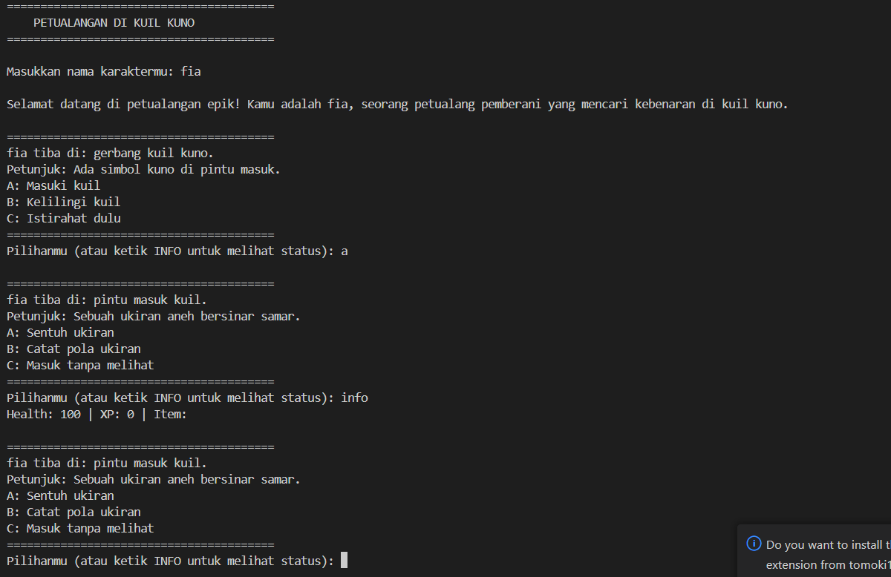

# README

## Identitas Diri
**Nama:**  Lutfiah Nurul Aulia 
**NIM:**  102022400240
**Kelas:** SI-48-10

---

## Penjelasan Alur Cerita
Petualangan ini dimulai ketika karakter utama, seorang petualang pemberani, memasuki sebuah kuil kuno yang penuh misteri. Tujuan dari petualangan ini adalah mencari harta karun legendaris yang tersembunyi di dalam kuil. Pemain harus melalui serangkaian tantangan, teka-teki, dan bahaya untuk mencapai tujuan akhir. Setiap keputusan yang diambil akan mempengaruhi jalannya cerita, kesehatan karakter (health), serta pengalaman yang diperoleh (XP).

Pemain memulai dengan **100 health** dan **0 XP**. Beberapa pilihan dalam game akan mengurangi **health**, misalnya terkena jebakan atau diserang musuh. Jika **health mencapai 0**, pemain kalah dan permainan berakhir. Sebaliknya, XP bertambah ketika pemain menyelesaikan tantangan atau menemukan item penting. XP tidak mempengaruhi kemenangan, tetapi semakin tinggi XP, semakin banyak petunjuk dan keuntungan yang bisa diperoleh.

Pemain menang jika berhasil mencapai **Ruang Harta Karun (Scene 10)** dalam keadaan hidup.

---

## Penjelasan Setiap Scene dan Hubungannya
Di bawah ini adalah penjelasan singkat dari setiap scene dan bagaimana scene tersebut terhubung dengan scene lainnya:

1. **Gerbang Kuil Kuno** (Scene 1) - Pemain memilih untuk masuk ke kuil atau menjelajah sekelilingnya.
2. **Pintu Masuk Kuil** (Scene 2) - Pemain dapat menyentuh ukiran, mencatat pola, atau masuk tanpa melihat.
3. **Tangga Spiral Menuju Bawah Tanah** (Scene 3) - Pemain bisa turun perlahan (-10 health, +20 XP), loncat cepat (-15 health, +10 XP), atau mencari jalan lain.
4. **Ruang Persembahan** (Scene 4) - Ada patung besar, altar, dan pilihan untuk meninggalkan ruangan (-10, +25 XP / -5, +15 XP / -0, +10 XP).
5. **Lorong Bercabang** (Scene 5) - Pemain memilih jalur kiri (-10 health, +30 XP), kanan (-5 health, +15 XP), atau kembali (-0 health, +5 XP).
6. **Ruang Penyimpanan Rahasia** (Scene 6) - Pemain dapat membuka kotak misterius (+50 XP), memeriksa sekitar (+20 XP), atau keluar (+10 XP).
7. **Ruang Rahasia di Balik Lorong** (Scene 7) - Pemain menemukan buku tua dan bisa membacanya (+15 XP) atau mengambilnya (+10 XP).
8. **Ruang Ritual Kuno** (Scene 8) - Ada lingkaran sihir (-10 health, +25 XP), simbol yang bisa dihancurkan (-15 health, +10 XP), atau jalan lain (-0 health, +5 XP).
9. **Gerbang Terakhir** (Scene 9) - Pemain harus mendorong pintu (-10 health, +20 XP), mencari mekanisme tersembunyi (-5 health, +15 XP), atau beristirahat (-0 health, +5 XP).
10. **Ruang Harta Karun** (Scene 10) - Pemain dapat membuka peti (-50 health, +100 XP), memeriksa sekitar (-10 health, +30 XP), atau kembali ke gerbang (-0 health, +10 XP).

Berikut diagram sederhana hubungan antar scene:
```
Scene 1 -> Scene 2 -> Scene 3 -> Scene 4 -> Scene 5 -> Scene 6 -> Scene 7 -> Scene 8 -> Scene 9 -> Scene 10
```
Setiap scene memiliki tiga pilihan yang mengarah ke scene berikutnya dengan dampak yang berbeda pada karakter pemain.

---

## Refleksi
### Hal Baru yang Dipelajari
Selama mengerjakan tugas ini, saya belajar beberapa hal baru, antara lain:
- Implementasi konsep **Pemrograman Berorientasi Objek (OOP)** dalam Java, termasuk penggunaan **class, objek, enkapsulasi**, dan hubungan antar kelas.
- Penggunaan **Scanner** untuk mengambil input dari pengguna.
- Cara membuat **alur cerita interaktif** menggunakan struktur data yang saling terhubung.
- Mengelola **state game** seperti kesehatan karakter, pengalaman, dan item yang dikumpulkan.

---

## Sumber Rujukan
Berikut adalah beberapa sumber yang digunakan dalam mengerjakan tugas ini:
1. **Dokumentasi Java** 

2. **Tutorial Java OOP** dari GeeksForGeeks (https://www.geeksforgeeks.org/object-oriented-programming-in-java/)
3. **Forum Stack Overflow** untuk mencari solusi dari error yang muncul saat debugging.
4. **Materi kuliah Pemrograman Berorientasi Objek (PBO)** yang diberikan oleh dosen.

---

## Penutup
Tugas ini sangat menarik karena memungkinkan saya untuk menggabungkan logika pemrograman dengan kreativitas dalam membuat cerita petualangan. Jika ada saran atau pertanyaan mengenai kode atau alur cerita, jangan ragu untuk menghubungi saya!

Terima kasih!

